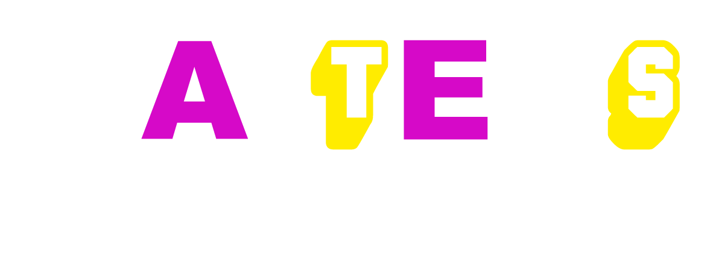

# Gaitens Leisure Group Staff Portal

An internal digital workplace for Gaitens Leisure Group teams.  
The portal brings day-to-day staff operations, communication, recognition, and manager workflows into one secure app.

## What The App Does

The Staff Portal helps teams stay informed, complete tasks, and collaborate across sites without relying on scattered chats, paper processes, or disconnected tools.

Core outcomes:
- Centralized communication and updates for all staff
- Faster manager workflows for approvals and people operations
- Better staff engagement through recognition and feedback channels
- Clear visibility of upcoming events, meetings, and training progress

## Key Features

### Staff Experience
- Personal dashboard with important updates and quick actions
- Notices and announcements with unread tracking
- Holiday request submission and calendar visibility
- Training modules and progress/completion tracking
- Employee of the Month nominations and results
- Ideas and app feedback submission
- Anonymous reporting and grievance channels
- Social, blog, and photo album areas for team culture

### Manager And Admin Tools
- Staff management and role-based access controls
- Meeting creation, updates, and follow-up tracking
- Holiday request review and approval flows
- Achievement and badge request workflows
- Notice publishing and content management
- Disciplinary and legal acknowledgement workflows
- Management calendar and operational planning views

## Value For The Team

- **For staff:** a clear single place to get updates, complete actions, and be heard
- **For managers:** less admin overhead and faster, auditable approval processes
- **For the business:** stronger engagement, better governance, and more consistent communication standards

## Privacy, Security, And GDPR Approach

This portal is designed for internal business use and supports good GDPR-aligned practices:
- Role-based access to limit data exposure to authorized users
- Authentication and session controls to protect account access
- Audit-friendly workflows around approvals, acknowledgements, and records
- Data minimization principles (collect only what is needed for operations)
- Support for retention and review processes to meet internal policy obligations

> Note: GDPR compliance depends on both application behavior and operational policy (for example retention schedules, lawful basis, and subject rights handling). Final compliance should always be validated by your internal compliance/legal process.

## Platform Snapshot

- Built with Next.js and TypeScript
- Uses Supabase for data and authentication services
- UI powered by Tailwind CSS
- Validation handled with Zod

---

This repository is the source code for the internal Gaitens Leisure Group Staff Portal.
